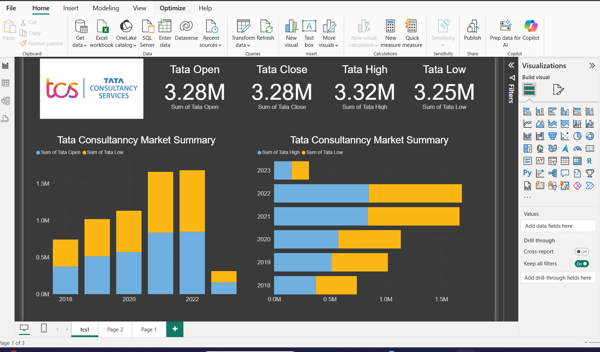
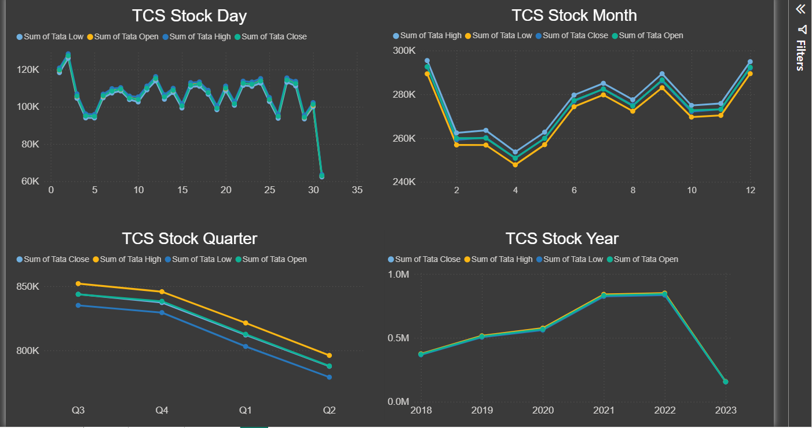

## 🧠 Strategic Insights & Applications

The dashboard is designed as a comprehensive tool for analyzing TCS stock behavior, offering meaningful insights across multiple time scales. It functions not only as a visual representation of historical performance but also as a springboard for strategic investment planning and market evaluation.

## 📸 Dashboard Previews

### 🔹 TCS Market Summary Dashboard

### 🔍 Time-Based Trend Analysis
- **Daily View**: Captures nuanced market movements to support intraday decision-making and high-frequency trading strategies.
- **Monthly Overview**: Highlights recurring patterns and seasonal fluctuations that may align with fiscal events or corporate actions.
- **Quarterly Breakdown**: Enables comparative analysis across quarters to uncover performance consistency or irregularities.
- **Annual Summary**: Illustrates long-term trajectory with visual markers for growth peaks and declines, notably the 2023 contraction.

### 📌 Key Observations
- **Consistency in Highs**: Sustained peak values suggest stability, disrupted only in 2023.
- **Post-Dip Recoveries**: Several periods demonstrate upward correction after performance drops, a useful indicator for timing investment cycles.
- **Volatility Mapping**: Daily breakdown reveals dynamic price ranges essential for risk assessment and sensitivity analysis.

### 🔹 TCS Stock Performance Overview

## 🛠️ Customization Potential

- Integrate additional benchmarks such as Nifty IT or Sensex to contextualize TCS's relative performance.
- Employ advanced forecasting techniques (e.g., ARIMA, Prophet) for modeling future price movements.
- Set conditional alerts via Power BI Service to monitor thresholds and automate portfolio responses.

## 📖 Usage Guidelines

To fully leverage the dashboard:
1. **Navigate** using time-frame slicers to switch between daily, monthly, quarterly, and yearly views.
2. **Interact** with visuals by hovering for precise data values.
3. **Apply Filters** to focus on specific time periods or data segments.
4. **Export Reports** to presentation formats for stakeholder communication or archival purposes.

---
